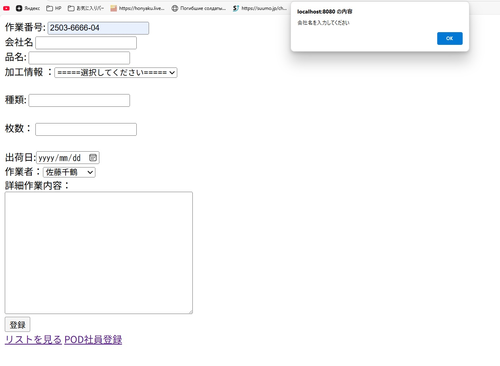
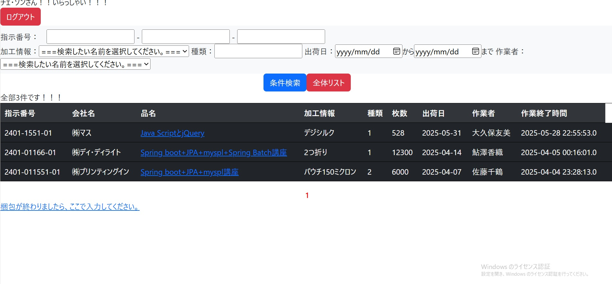
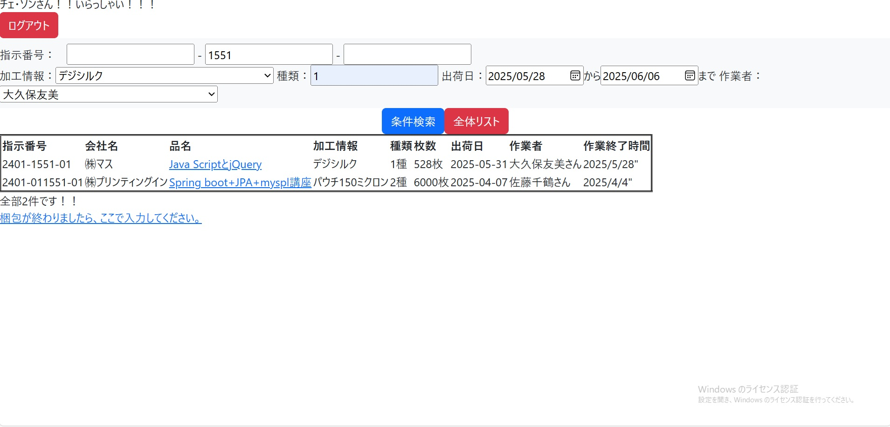
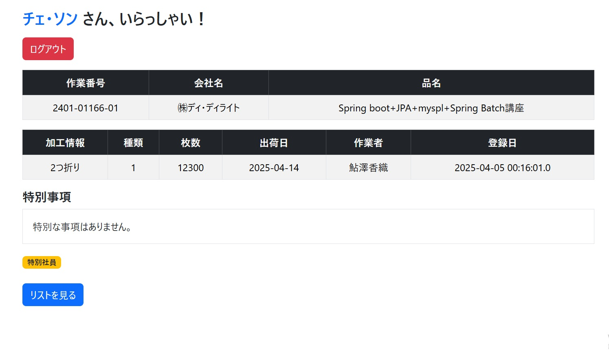

# 🌱 Pod Manager - Spring Boot Webアプリケーション

Spring Bootをベースに開発したWebアプリケーションです。  
ユーザー登録、ログイン、タスクリスト管理などの機能が含まれています。

## 🛠 使用技術
- Java 17
- Spring Boot
- Maven
- Thymeleaf
- JavaScript
- HTML/CSS

## 📂 主な機能
- ユーザー登録・ログイン
- タスクリストの追加・削除
- 条件による検索機能
- JavaScriptによるインタラクション

## 📷 スクリーンショット

| 仕事登録画面 | 全体リスト |
|-------------|------------|
|  |  |

| 条件検索 | 詳細ページ |
|---------|------------|
|  |  |
